# EasyShop – Product Filter Application

EasyShop is a responsive frontend e-commerce interface that allows users to browse, search, filter, and interact with products through a simple and intuitive shopping flow.  

The project demonstrates common e-commerce UI behaviors such as product filtering, sorting, search functionality, cart interaction, and a checkout summary page using **vanilla JavaScript**.

---

## Live Demo

https://easyshop7.netlify.app/

---

## Features

### Product Listing
- Displays multiple product cards on the landing page in a responsive grid layout.
- Each card contains product details and interaction buttons.

### Product Filtering
Users can filter products using multiple conditions:
- Category based filtering
- Price based filtering
- Combined filtering logic

### Product Sorting
Products can be sorted according to price:
- Ascending order
- Descending order

### Search Functionality
- A search bar allows users to search products by **name or category**.
- Works together with filtering logic to refine product results.

### Cart Interaction
- Users can add items using **Add to Cart** or **Buy Now**.
- When clicked, a **cart modal** opens at the top-right corner.

### Checkout Summary Page
- Clicking **Proceed to Checkout** opens a summary page.
- The page displays:
  - Selected products
  - Total amount to be paid

### Order Confirmation
- After confirming the order, a message **"Order Placed"** is shown.
- The user is automatically redirected back to the homepage.

### Responsive Design
The application is fully responsive and optimized for:
- Desktop
- Tablet
- Mobile devices

---

## Technologies Used

- HTML5
- CSS3
- JavaScript (Vanilla JavaScript)

---

## Project Goals

This project was built to practice and demonstrate core frontend development concepts:

- DOM Manipulation
- Product filtering and sorting logic
- Search functionality
- UI interaction handling
- Responsive layout design

---
## Screenshots

### Homepage

  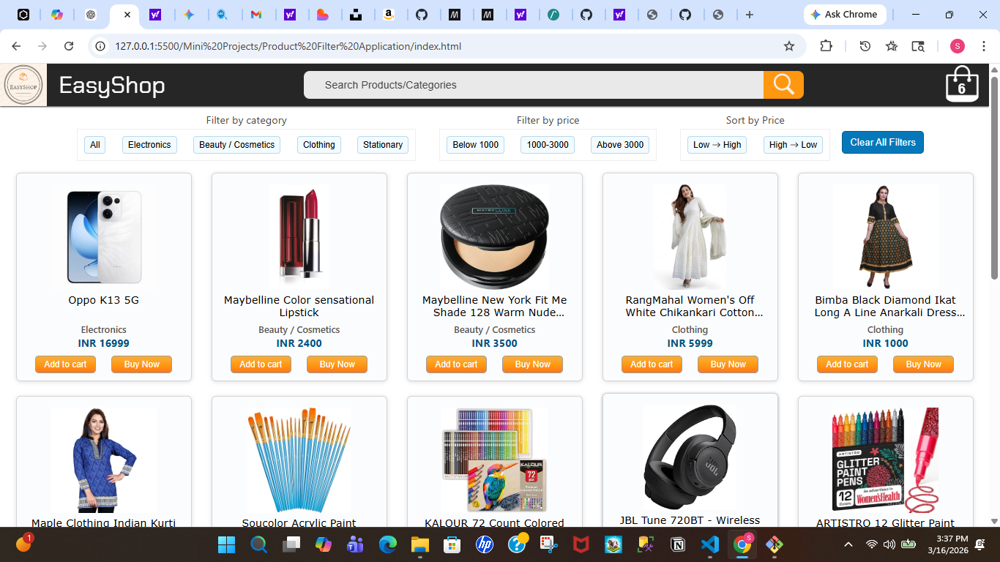
  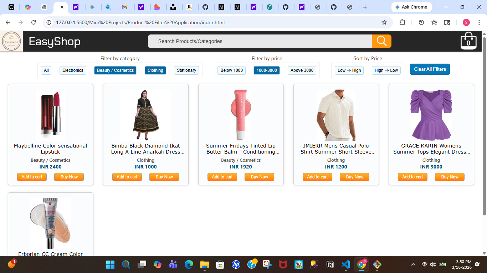

  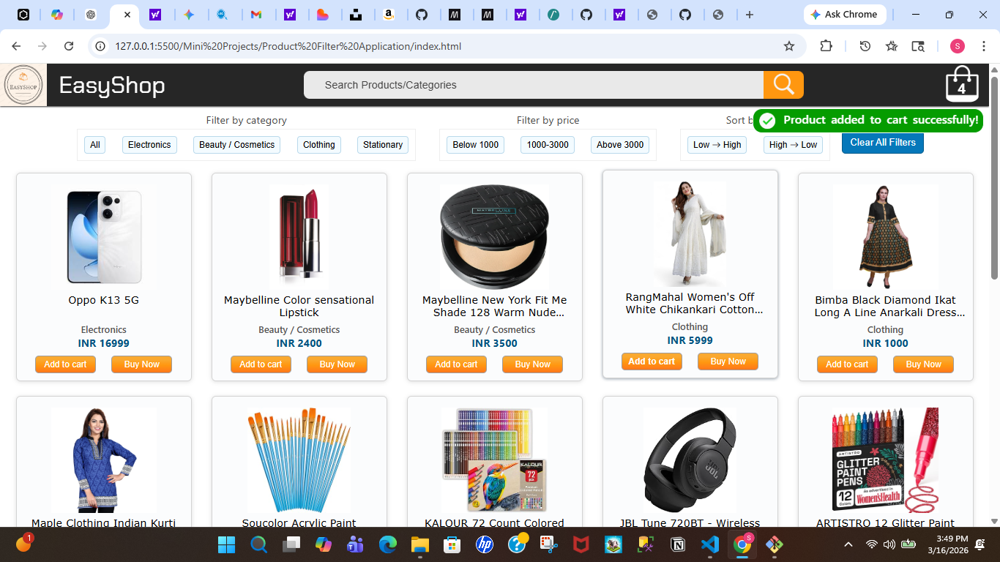
  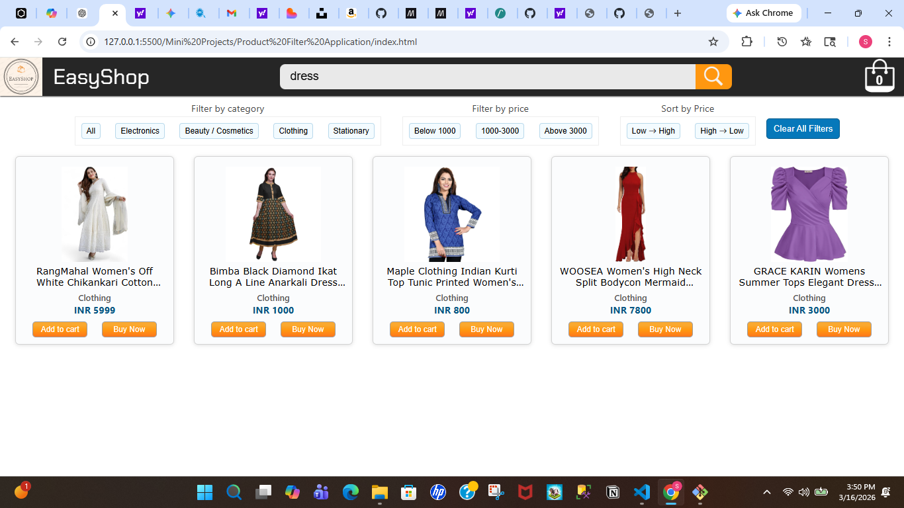

### Cart Modal

  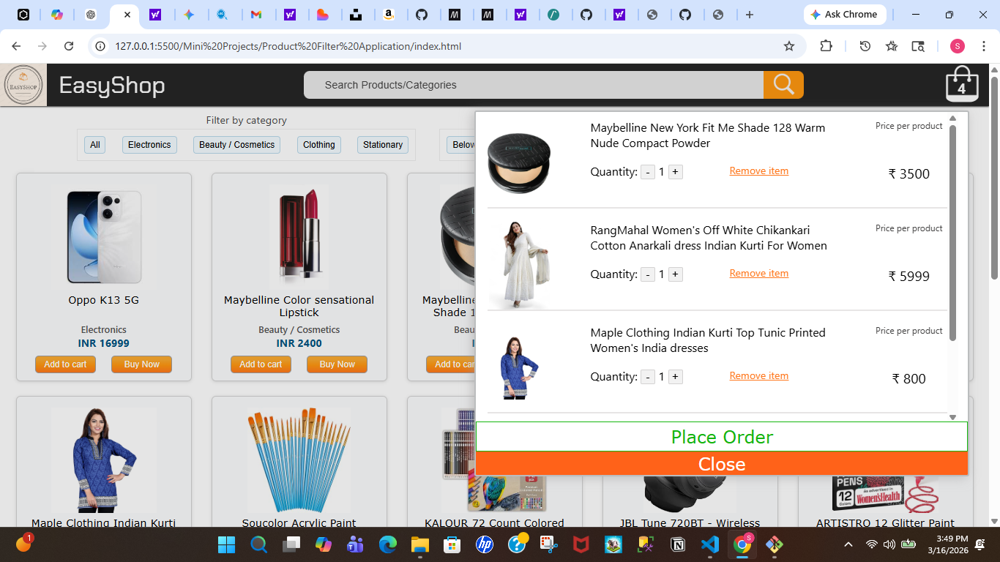

### Summary Page

  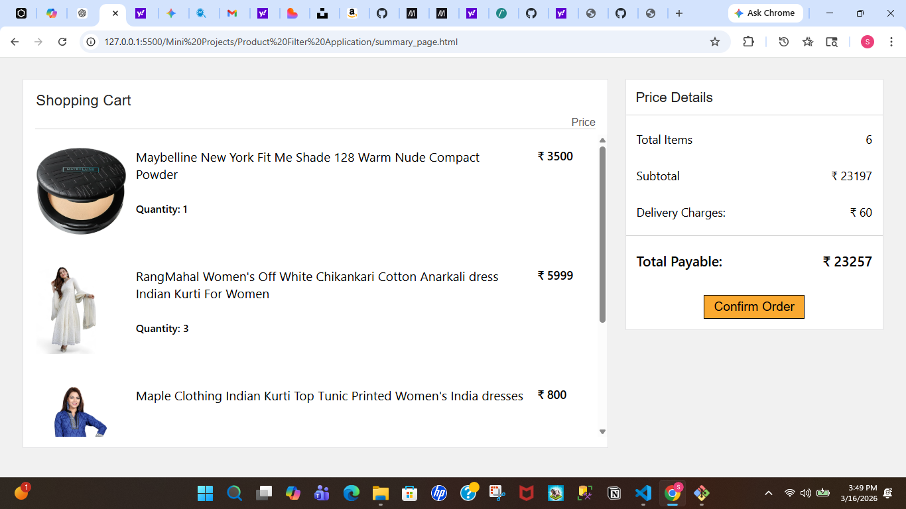

### Mobile View

  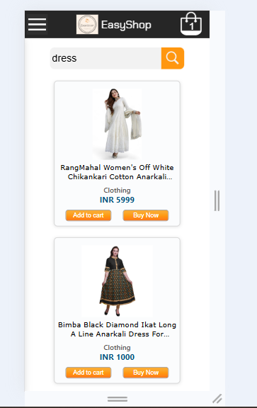
  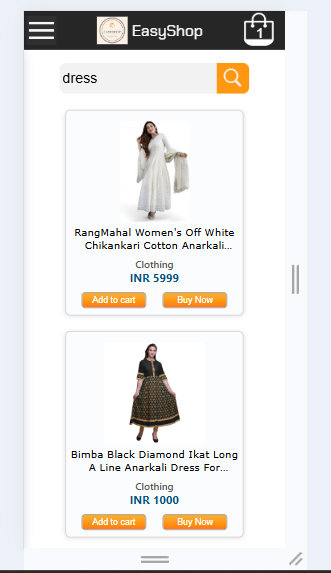
  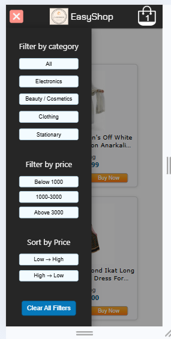

  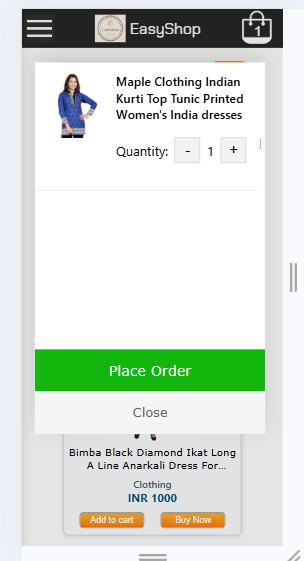
  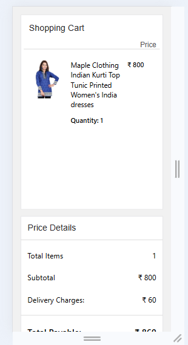

---
---

## Future Improvements

Potential future enhancements include:

- Backend integration for product data
- Persistent cart using local storage
- Payment gateway integration
- User authentication system
- Dedicated product detail pages

---

## Author

Shreya
